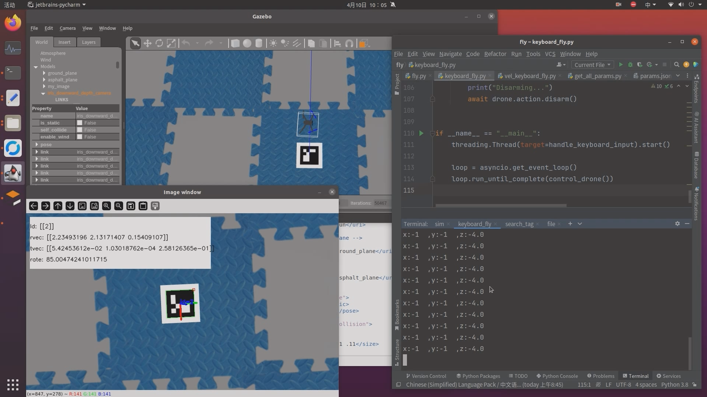

# fly

px4相关

## tpis

- 下载`https://www.gyan.dev/ffmpeg/builds/ffmpeg-release-essentials.zip`

```bash
# 视频处理
ffmpeg -i w.mp4 -c:v libx264 -c:a aac w_safe.mp4
```

## 演示

- 模拟
- 

- 键盘控制飞行_带摄像头画面
- 

- 键盘控制飞行_带摄像头画面_地面有二维码
- 

- 识别地面aruco
- 

- 室内环境搭建，识别aruco
- 

- 室内无人机自主飞行到二维码上空5m处，悬停
- 

- 通过aruco计算的位置与真实的位置误差
- 